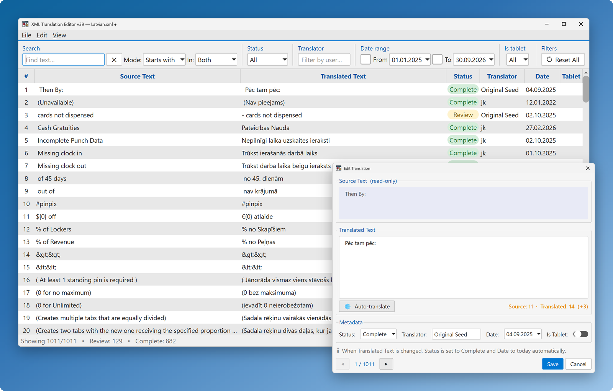
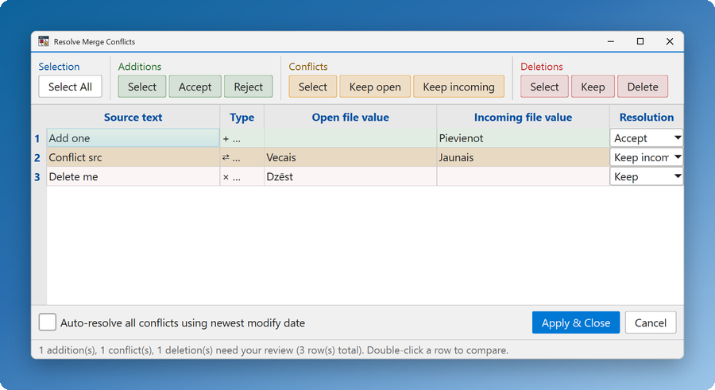
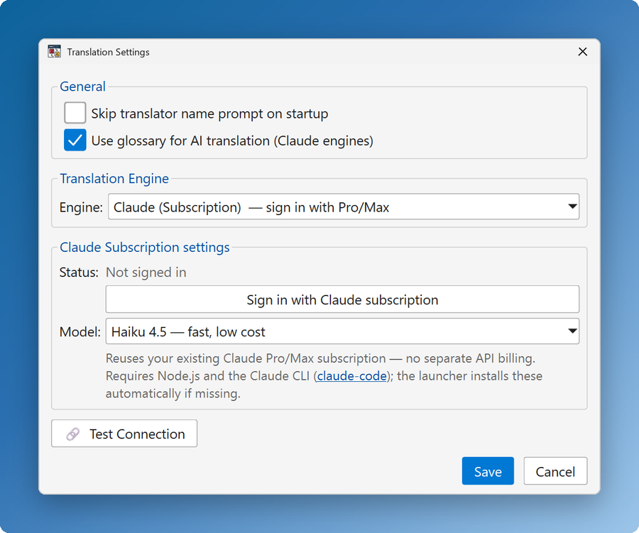
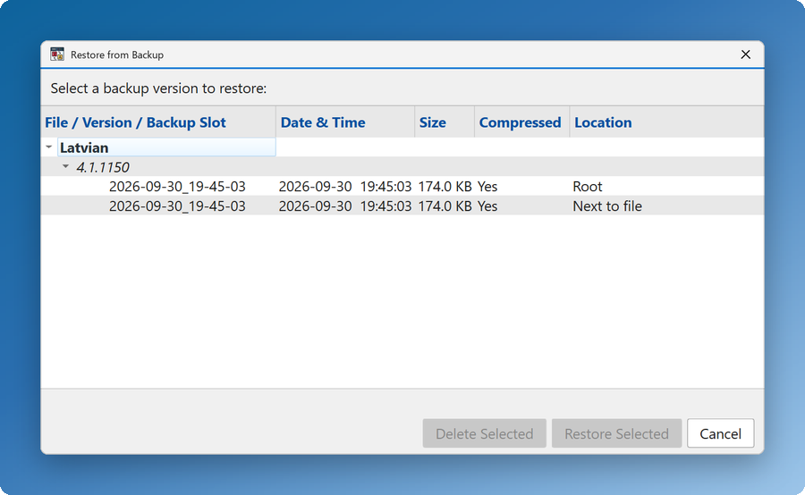

# XML Translation Editor

A Windows desktop app for editing XML localization files — the `<string name="…">translation</string>`
files where every source text carries its translation, a status, a translator and a date. It
shows every string in a filterable table, tracks what is New, in Review or Complete, fills in
translations with machine translation or Claude, and backs up every file it opens, rewriting only
the strings that change and leaving the rest of the file as it was.

  <picture>
    <source media="(prefers-color-scheme: dark)" srcset="docs/images/hero_dark.png">
    
  </picture>

## What it does

- **Find any string fast.** Search source or translated text, and filter by status, translator,
  date range and the tablet flag. → [Filtering](docs/FEATURES.md#filtering)
- **Edit one entry at a time.** The Edit window steps through entries from the keyboard and warns
  when a translation runs much longer than its source. →
  [Editing Translations](docs/FEATURES.md#editing-translations)
- **Translate automatically.** Seven engines (Claude, Claude with a Pro/Max subscription, DeepL,
  LibreTranslate, Google, MyMemory, Microsoft), a per-file glossary for Claude, and
  Robo-Translate to work through the New entries hands-free. →
  [Auto-Translation](docs/FEATURES.md#auto-translation)
- **Merge another translator's file.** Review additions, conflicts and deletions side by side
  before anything changes. → [Merge from File](docs/FEATURES.md#merge-from-file)
- **Never lose work.** Autosave, a versioned backup every time a file opens, and a browser to
  restore any of them. → [Autosave](docs/FEATURES.md#autosave), [Backup](docs/FEATURES.md#backup)
- **Keep the file header right.** Edit the language name and version, and see how many strings
  are New, in Review or Complete. → [File Properties](docs/FEATURES.md#file-properties)
- **Make it yours.** Dark and light themes, any UI font and size, and keyboard shortcuts you can
  rebind. → [Themes](docs/FEATURES.md#themes), [Keyboard Shortcuts](docs/FEATURES.md#keyboard-shortcuts)

## Screenshots

<table>
  <tr>
    <td width="33%" align="center" valign="top">
      <a href="docs/FEATURES.md#merge-from-file"><picture>
        <source media="(prefers-color-scheme: dark)" srcset="docs/images/merge_dark.png">
        
      </picture></a> 
      <b>Merge from File</b>
    </td>
    <td width="33%" align="center" valign="top">
      <a href="docs/FEATURES.md#setting-up-translation"><picture>
        <source media="(prefers-color-scheme: dark)" srcset="docs/images/translation_settings_dark.png">
        
      </picture></a> 
      <b>Translation Settings</b>
    </td>
    <td width="33%" align="center" valign="top">
      <a href="docs/FEATURES.md#restoring-a-backup"><picture>
        <source media="(prefers-color-scheme: dark)" srcset="docs/images/restore_dark.png">
        
      </picture></a> 
      <b>Restore from Backup</b>
    </td>
  </tr>
</table>

## Get started

Runs on Windows 10 and 11.

1. Download **Source code (zip)** from the
   [latest release](https://github.com/janiskalnins/XML-Translation-Editor/releases/latest) and
   unzip it.
2. Double-click `run_translator.bat`. The first time, it installs whatever is missing — Python and
   PySide6, plus Node.js and the Claude CLI for the Claude subscription engine (through `winget`,
   `pip` and `npm`) — then starts the app.
3. Open an XML file with **File → Open XML…**, or drop it onto the window.

Were you given `XMLTranslationEditor.exe`? Just run it — everything is inside it, there is
nothing to install.

If the automatic install can't run (no internet, `winget` blocked by policy), see
[Manual Installation](docs/BUILDING.md#manual-installation).

## Documentation

- [Features and reference](docs/FEATURES.md) — every feature, the settings file and the XML
  file format.
- [User Guide (PDF)](Resources/User_Guide.pdf) — an illustrated guide to every window.
- [Troubleshooting](docs/FEATURES.md#troubleshooting) — common problems and their fixes.

## Your data

- **Settings**, including translation API keys, are kept in `translation_editor_settings.json`
  next to the app, with a daily snapshot in `translation_editor_settings.backups.zip`. →
  [Settings](docs/FEATURES.md#settings), [Settings backup](docs/FEATURES.md#settings-backup)
- **Backups** of every file you open go to an `XML_Translation_file_Backups` folder next to the
  file, next to the app, or both. → [Backup](docs/FEATURES.md#backup)

## For developers

- [BUILDING.md](docs/BUILDING.md) — requirements, running from source, the launchers and
  building the standalone `.exe`.
- [tests/README.md](tests/README.md) — the offscreen checks and the pre-commit hook.
- [docs/architecture/](docs/architecture/) — how the code is organised.
